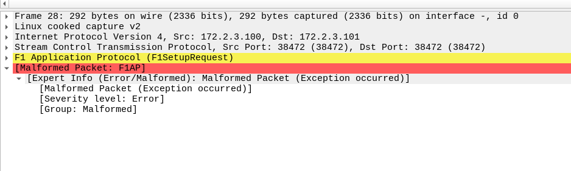

# OSC DU L2 on K8S

:::warning
If you didn't see any images on this page, open the following url on a new tab and proceed with the certificate <https://minio.bmw.lab/minio/health/live>

:::


## Deployment Plan


:::info
This work are hosted here  <https://github.com/motangpuar/o-du-l2>

:::


| Phase | Log |
|----|----|
| Build Phase |    |
| Testing Phase |    |
| Integration Phase |    |
| Added Feature (YMA Branch) |    |


 


---

## Build

### Build Docker Image


```bash
FROM nexus3.o-ran-sc.org:10002/o-ran-sc/bldr-ubuntu18-c-go:1.9.0

# ======================================================================

ADD . /opt/o-du-l2
WORKDIR /opt/o-du-l2

RUN apt-get update && apt-get install -y libpcap-dev && apt-get install -y libxml2-dev net-tools

RUN cd build/odu && make clean_odu odu MACHINE=BIT64 MODE=FDD

RUN cd build/odu && make clean_odu odu MACHINE=BIT64 MODE=TDD
#CMD /opt/o-du-l2/bin/odu/odu

# add netconf user
RUN cd build/scripts && /bin/bash add_netconf_user.sh

#cleanup netconf folder and install libraries
RUN cd build/scripts && /bin/bash install_lib_O1.sh -c

# Install yang models and load initial configuration
RUN cd build/scripts && /bin/bash load_yang.sh

RUN cd build/odu && make clean_odu odu MACHINE=BIT64 MODE=FDD O1_ENABLE=NO
```


1. Build using `podman`, `docker` .

   ```bash
   git clone <REPO>
   podman build -t osc-dul2-xxx -f Dockerfile_non_O1 
   ```
2. Tag and push image to repository.

   ```bash
   podman tag <IMAGE_NAME> quay.bmw.lab/<UserName>/<IMAGE_NAME>
   podman push quay.bmw.lab/<UserName>/<IMAGE_NAME>
   ```


## Testing Phase

### Docker Execution


1. Create container as `root` with `SYS_PTRACE` and `seccomp=uncondined` capability.

   ```bash
   sudo podman run -d --privileged --security-opt seccomp=unconfined --cap-add=SYS_PTRACE quay.bmw.lab/infidel/osc-dul2 sleep infinity
   ```
2. …


### Kubernetes Execution


1. Pull image from repo at `quay.bmw.lab`

   ```bash
   podman pull quay.bmw.lab/infidel/osc-dul2
   ```
2. Update the deployment manifests according to [this](/doc/osc-du-l2-on-k8s-l83I46bRv0). Important sections are `securityContext`.

   ```bash
   kind: Deployment
   apiVersion: apps/v1
   metadata:
     name: osc-l2
     namespace: bmw-cicd
     labels:
       app: osc-l2
   spec:
     selector:
       matchLabels:
         app: osc-l2
     template:
       metadata:
         creationTimestamp: null
         labels:
           app: osc-l2
       spec:
         containers:
           - name: osc-l2
             image: quay.bmw.lab/infidel/osc-dul2
             command:
               - sleep
               - infinity
             resources: {}
             terminationMessagePath: /dev/termination-log
             terminationMessagePolicy: File
             imagePullPolicy: Always
             securityContext:
               privileged: true
         restartPolicy: Always
         terminationGracePeriodSeconds: 30
         dnsPolicy: ClusterFirst
         securityContext:
           runAsUser: 0
           runAsGroup: 0
         schedulerName: default-scheduler
     strategy:
       type: RollingUpdate
       rollingUpdate:
         maxUnavailable: 25%
         maxSurge: 25%
     revisionHistoryLimit: 10
     progressDeadlineSeconds: 600
   
   ```
3. The current runtime command of this image is `sleep infinity` so you still need to login manually and execute the `osc-du` binary.

   

## Integration Phase

### IP Plan

| **CNF** | **IP** | **Service Domain** | **Purpose** |
|----|----|----|----|
| OSC-ODU | 172.2.3.100/24 | `osc-l2-du` | O-DU & PHY-Stub |
| OSC-CU_STUB | 172.2.3.101/24 | `osc-cu-stub` | CU Stub |
| OSC-RIC_STUB | 172.2.3.102/24 | `osc-ric-stub` | RIC Stub |
| OAI-CU | 172.2.3.103/24 | `oai-gnb-cu` | Real CU |
| OSC-RIC | 172.2.3.104/24 | `osc-ric` | Real RIC |


### Configs

|    | Default | New Values |
|----|----|----|
| DU Config  |   |    |
| CU Stub config |    |    |


### Integration Log

| **CU** | **DU-L2** | **DU-L1** | **rfSim** | **UE** | **Remarks** |
|----|----|----|----|----|----|
| OAI-CU (**2023.w43**) | OSC-DU-L2 (**master**) | OSC Phy_stub | OSC Phy_stub | OSC Phy_stub | *  **==Tested==**  * <ul><li>**Error**: Failed to decode PDU</li></ul> |
| OAI-CU (**Tony**) | OSC-DU-L2 (**Tony**) | OSC Phy_stub | OSC Phy_stub | OSC Phy_stub | **Tested** <ul><li>UE RRC Complete</li><li>Generate downlink data from CU succeed (gtp)</li><li>UE is not configurable hence can't be registered into real CN </li></ul>|
| OAI-CU (**Tony**) | OSC-DU-L2 (**master**) | OSC Phy_stub | OSC Phy_stub | OSC Phy_stub | * **Error**: F1AP_ProtocolIE_ID_id 89 Unknown |
| OAI-CU (**2023.w43**) | OSC-DU-L2 (**Tony**) | OSC Phy_stub | OSC Phy_stub | OSC Phy_stub | *  **==Not Tested Yet==**   |
| OAI-CU (Tony) | OSC-DU-L2 (Tony) | OAI-L1 | OAI rfSIM | OAI UE | **Not Tested Yet**  <ul><li>Richard & Ming Already Test</li><li>Missing msg1 reply</li></ul>  |
| OAI-CU | OAI-DU-L2 | OAI-DU-L1 | rfSim | UE | *  |


## :warning: Bugs and Findings


> [!WARNING]
> Bugs Here…


### 1. ODU Subprocess

> Found: **April 13, 2024** 
>
> Patched: June 25, 2024 

|    | **Fedora** (`podman`) | **Ubuntu** (`docker`) |
|:---|----|----|
| Execution command |    |    |
| GDB Log |   |   |
| Hypothesis |    |    |
| Conclusion |    |    |


\
### 2. Hardcoded IP

> Found: **June 25, 2024** 
>
> Patched: June 25, 2024 


 

- [x] Modify the code.
- [ ] \


### 3. Malformed sIB Packet

* Mentioned Log

[osc-f1ap-malformed-sib.pcapng 131160](attachments/98af113f-a6dd-4354-a931-748a68bb5563.false)


 


**Try build using different release instead of master**

- [x] Clone I Release
- [x] Compile and build container image
- [x] Push container image with special tag to quay
- [ ] Update helm chart for osc-du image to new build
  * Update mount configmap location for `odu_config.xml`


\
**Debug how OSC-DU parse the XML file.**


  

| Variable | Array Contained | Function | File Contain |
|----|----|----|----|
| `sib1Msg` | `duSysInfo` |    | `du_cfg.c` |
|    |    |    |    |


[What is SIB1](http://howltestuffworks.blogspot.com/2019/10/5g-nr-system-information-block-1-sib1.html)


 


 

 


 

### 4. Manually RUN OAI-CU 

```bash
/opt/oai-gnb/bin/nr-softmodem -O /tmp/cu.conf --sa --log_config.global_log_options level nocolor time
```


### 5. Tony's version


:::info
**Call Flow**

[tony-odu-oai-osc-RegistrationComplete.pcapng 21588](attachments/14895015-63c8-45d9-ac51-13c176c9df20.false)


:::


**OAI L1 Command Override** 

```javascript
cd ran_build/build
sudo ./nr-softmodem -O ../../../../OSC_L2/mwnl/oai_pnf_conf/oaiL1.nfapi.usrpb210.conf --sa -E --gNBs.[0].min_rxtxtime 6 --continuous-tx --nfapi 1
```


**OAI CU Command Override**

```javascript
/opt/oai-gnb/bin/nr-softmodem -O /tmp/cu.conf --sa --log_config.global_log_options level nocolor time
```


**OAI-CU (2023.w43) - OSC-DU (master)**


**Failed to decode PDU**


 


**OAI-CU (Tony) - OSC-DU  (master)**


 


\
#### Tony's version of OAI-CU & OSC-DU-L2 `Master` 


Tony's approach is to change OAI-CU's F1AP codec format according to OSC-CU. Need to reconsider this approach in the future as this approach will need always need a custom OAI-CU patched version to integrate with OSC-DU-L2


1. Git pull ***latest*** OAI-CU
2. Apply tony's patch on ***latest*** OAI-CU

   
   1. Find a way to compare tony's change on OAI-CU with the upstream code.
   2. `Tested` : Incompatible, many missing files and struct. 

   \

#### Automate Testing Cycle

- [x] Gather ready to use codes from scattered repos
- [x] Automate build process relevant code base using docker
- [x] Host builds with different tags

  \
  

  \
- [x] Deploy builds on kubernetes
